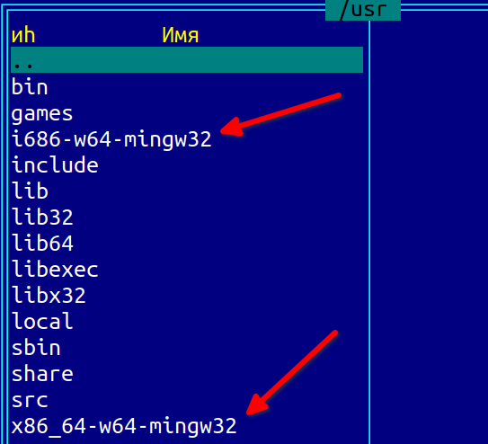
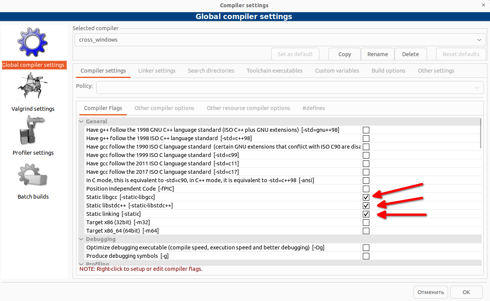
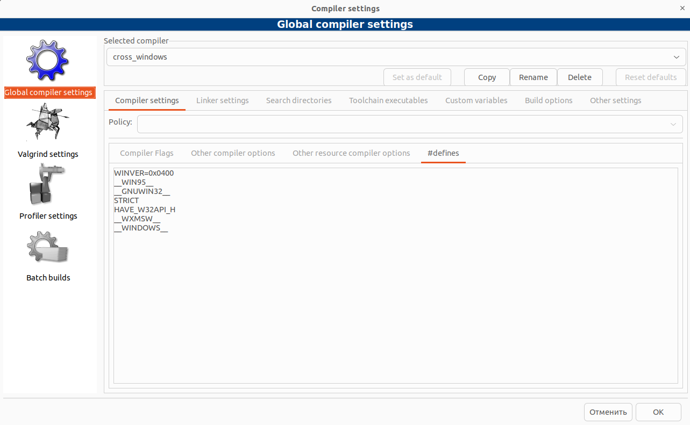
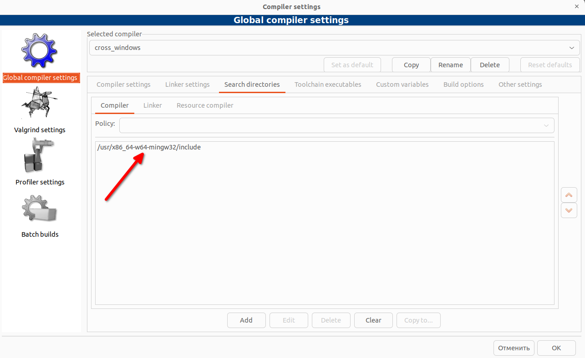
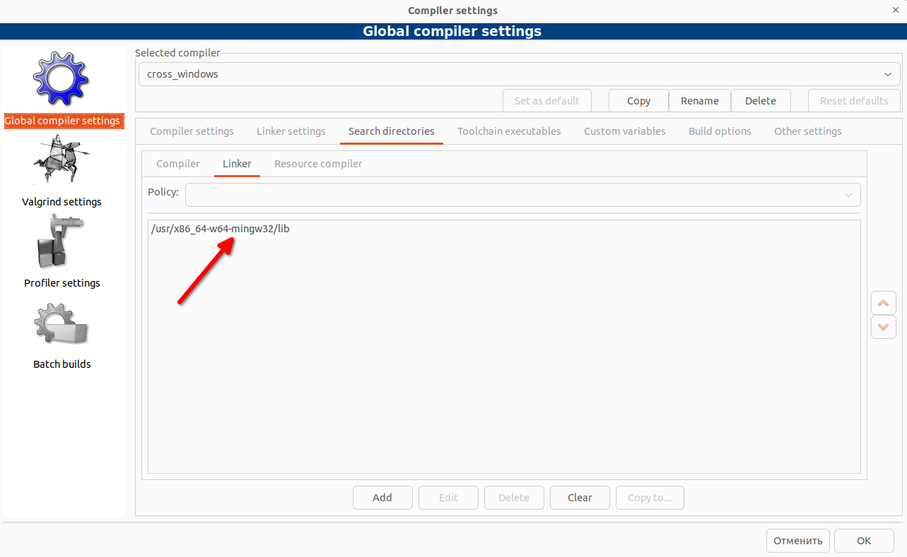
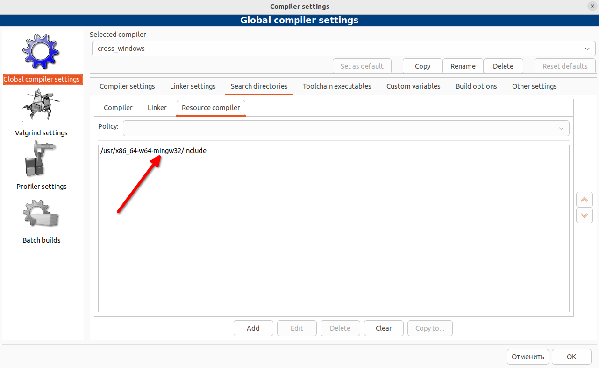
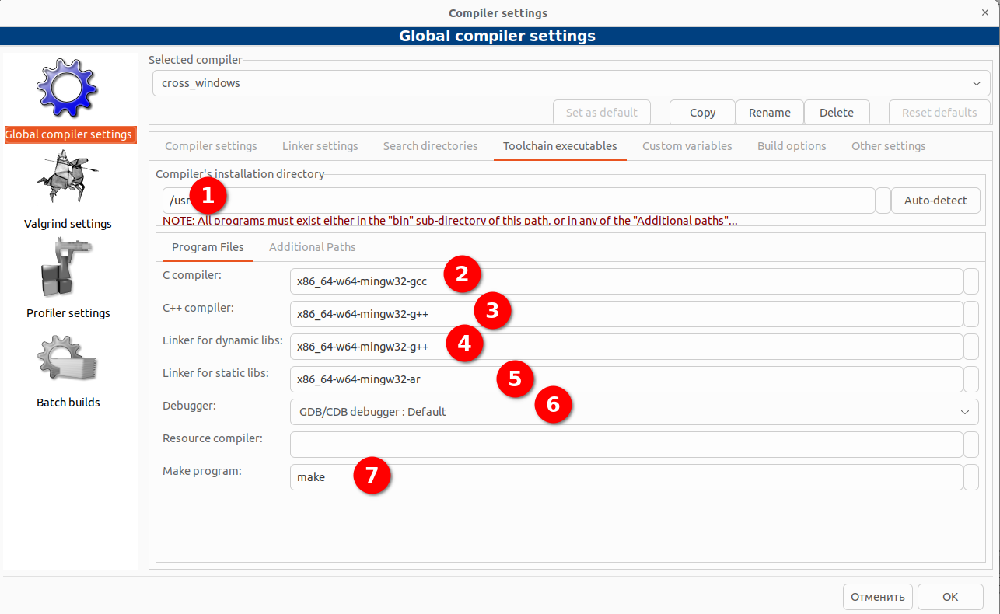
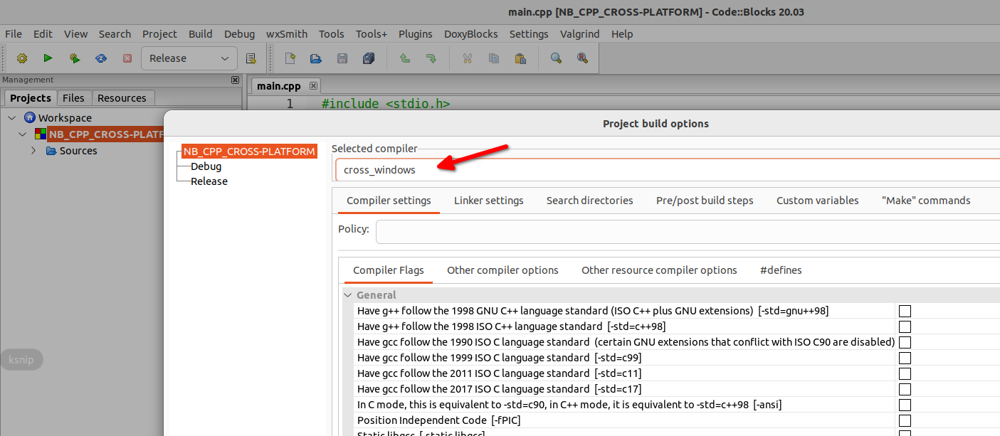

# CB_CPP_CROSS-PLATFORM
Пример программы на C++ в Code::Blocks с использованием кроссплатформенной компиляции 
(разработка в Linux Windows-программы)

**sudo apt install mingw-w64**







```
WINVER=0x0400
__WIN95__
__GNUWIN32__
STRICT
HAVE_W32API_H
__WXMSW__
__WINDOWS__
```







```
/usr/x86_64-w64-mingw32/include
/usr/x86_64-w64-mingw32/lib
/usr/x86_64-w64-mingw32/include
```



```
/usr
x86_64-w64-mingw32-gcc
x86_64-w64-mingw32-g++
x86_64-w64-mingw32-ar
make
```



https://wiki.codeblocks.org/index.php/Code::Blocks_and_Cross_Compilers

https://localcoder.org/how-to-compile-for-windows-on-linux-with-gcc-g
